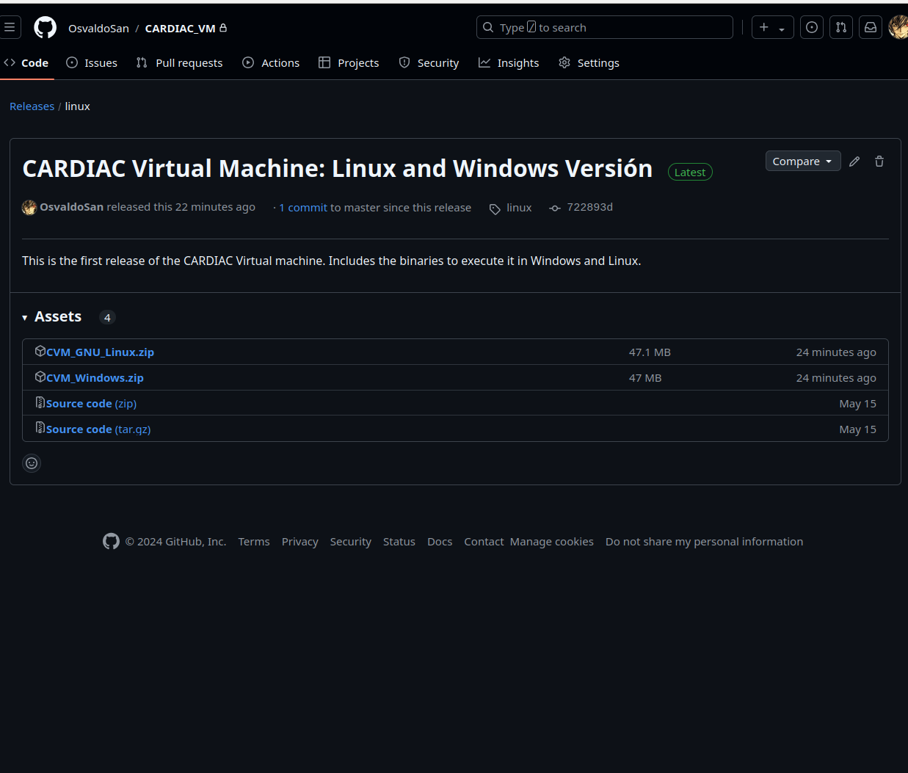

# CARDIAC Virtual Machine: A didactic model of computing

This is a virtual machine designed to explore concurrent and parallel computing using the renowned CARDIAC model, created by David Hagelbarger and Saul Fingerman.

# How to use it

## Binary Option

To use this version on Windows or Linux, you need to install the most recent version of the Java Runtime Environment. You can find it at[java](https://www.java.com/en/).

Go to the [repository](https://github.com/OsvaldoSan/CARDIAC_VM) and click on the *releases* section.

Once you have clicked there, you will see the following image:

Here, you can see two zip files that contain the binary code to execute the program in Windows and GNU/Linux. Download the version appropriate for your operating system.

### Binary Option: Linux

If you download the Linux version, you need to unzip it, and you will see the following folders:

These folders contain all the necessary information for the program to run. Next, go to the folder named *bin*, where you will see the following files:

Then, you need to execute the file named **CVM.sh**. You can run it from the file navigator by double-clicking it, which will show the following dialog. Here, click on "Run."

If you encounter any issues with this, another approach is to run it from the terminal using the following command:

After that, you will see the program start:

Instructions on how to use the virtual machine can be found in the PDF included in the repository. This PDF refers to the thesis for this project.

### Binary Option: Windows

## Create an executable with the source Code

If you, instead, want to create an executable from the source code, you can do so. You just need to follow the rules of the framework [Apache Maven](https://maven.apache.org/), and edit the *pom* file to your specifications.

Here is an example of how easy it is to deploy the application using Maven in the Linux terminal:

One of the greatest things about using Maven to deploy the application is that depending on the operating system you use, it will create the corresponding binary file. So if you want a Windows binary, you will need to deploy the app in a Windows file system.

For more information, visit [Apache Maven](https://maven.apache.org/).

